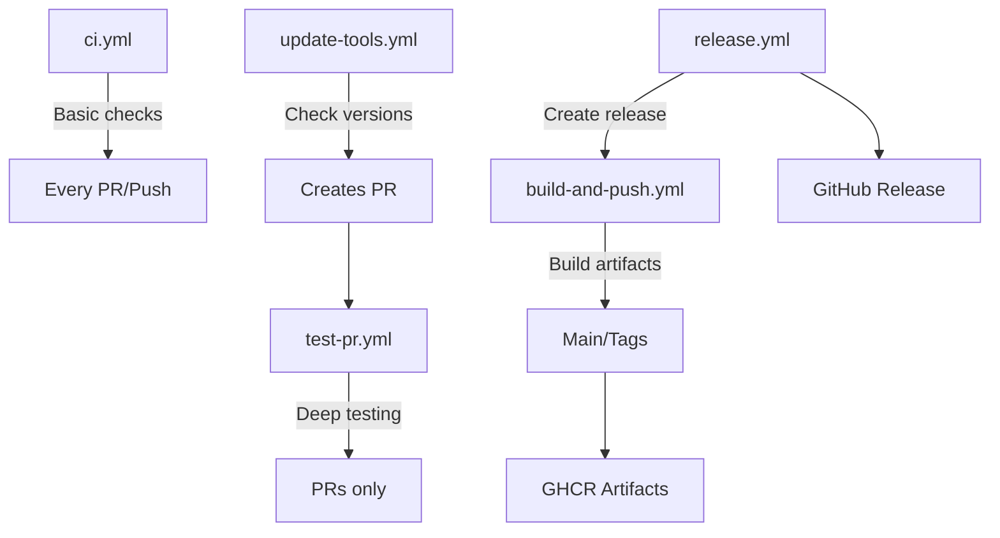

# GitHub Actions Workflows

This directory contains GitHub Actions workflows for automating the build, test, and release processes for the UDS Tools OCI artifacts.

## Workflows

### 1. CI (`ci.yml`)
**Trigger**: Push to main, Pull requests

Basic continuous integration checks:
- Lints shell scripts with ShellCheck
- Validates JSON configuration files
- Checks file permissions
- Lints Markdown files
- Tests common.sh functions
- Security scanning with Trivy
- Secret scanning with TruffleHog

### 2. Build and Push (`build-and-push.yml`)
**Trigger**: Push to main, tags, manual dispatch

Main workflow for building and pushing ORAS artifacts:
- Builds tools artifacts for Linux (amd64/arm64)
- Pushes to GitHub Container Registry
- Creates platform-specific artifacts
- Tests artifacts after push
- Creates GitHub releases for tags

**Manual trigger options**:
- `tag`: Custom tag for the artifacts (default: latest)

### 3. Test Pull Request (`test-pr.yml`)
**Trigger**: Pull requests that modify tools files

Comprehensive PR testing without pushing artifacts:
- Validates all shell scripts
- Validates tools configuration
- Tests downloading each tool
- Tests installer script
- Security scanning

### 4. Update Tool Versions (`update-tools.yml`)
**Trigger**: Weekly schedule (Mondays 9 AM UTC), manual dispatch

Automatically checks for and updates tool versions:
- Checks latest versions from upstream repositories
- Updates tools-config.json
- Creates pull request with updates

**Manual trigger options**:
- `tool`: Specific tool to check (optional)

### 5. Create Release (`release.yml`)
**Trigger**: Manual dispatch only

Workflow for creating new releases:
- Validates version format
- Updates default tag in configuration
- Creates git tag
- Triggers build workflow
- Creates GitHub release with notes

**Required inputs**:
- `version`: Version to release (e.g., v1.0.0)
- `release_notes`: Additional release notes (optional)

## Setup Requirements

### Repository Settings

1. **Permissions**: Ensure GitHub Actions has write permissions:
   - Go to Settings → Actions → General
   - Under "Workflow permissions", select "Read and write permissions"

2. **Package Visibility**: After first push, make packages public:
   - Go to https://github.com/users/YOUR_USERNAME/packages
   - Click on the package
   - Go to Package settings → Change visibility → Public

### Secrets

No additional secrets required. Workflows use:
- `GITHUB_TOKEN`: Automatically provided by GitHub Actions
- Has permissions for:
  - Reading repository contents
  - Writing packages to GitHub Container Registry
  - Creating releases and pull requests

## Usage Examples

### Manual Build and Push
```bash
# Trigger build with custom tag
gh workflow run build-and-push.yml -f tag=v1.2.3
```

### Check for Updates
```bash
# Check all tools for updates
gh workflow run update-tools.yml

# Check specific tool
gh workflow run update-tools.yml -f tool=helm
```

### Create a Release
```bash
# Create a new release
gh workflow run release.yml \
  -f version=v1.0.0 \
  -f release_notes="Initial release of UDS tools artifact"
```

## Workflow Dependencies



## Best Practices

1. **Version Tags**: Always use semantic versioning (v1.0.0)
2. **PR Testing**: All PRs are automatically tested
3. **Security**: Security scans run on every push
4. **Updates**: Tool versions are checked weekly
5. **Releases**: Use the release workflow for consistent releases

## Troubleshooting

### Build Failures
- Check GitHub Actions logs
- Ensure all tools are downloadable
- Verify JSON configuration is valid

### Authentication Issues
- GitHub token is automatically provided
- Ensure workflow has write permissions

### Update Workflow Issues
- Check API rate limits if many tools fail
- Verify tool repository URLs in workflow

## Local Testing

Test workflows locally using [act](https://github.com/nektos/act):
```bash
# Test CI workflow
act push

# Test PR workflow
act pull_request

# Test with custom event
act workflow_dispatch -e event.json
```